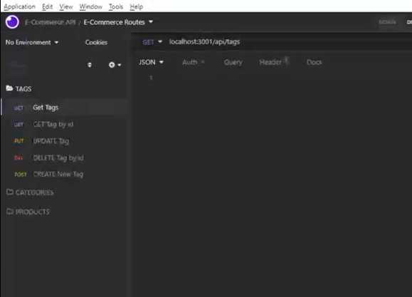

[![Contributors][contributors-shield]][contributors-url]
[![MIT License][license-shield]][license-url]

# A-Plus E-Commerce

   

    View application functionality! <a href="https://drive.google.com/file/d/1AoVxjgJZOerT6PMPznnZhCL7lWKMzciY/view"> Walkthrough Video</a>
  

## Table of Contents
* [Description](#description)
* [Usage](#usage)
* [Tests](#tests)
* [Built With](#built-with)
* [License](#license)
* [Credits](#credits)
* [Questions](#questions)

## Description:
This project was developed using starter code to create a back-end application for an e-commerce site that uses the command line interface (CLI) and object-relational mapping for various methods of data manipulation, storage, and retrieval when using HTTP methods with a RESTUL API.  

The schema.sql file was run in MySQL Workbench to create the ecommerce_db. I then ran the npm run seed command in the CLI to create the tables. Finally, before testing the routes I ran npm start in the CLI to start the server.

 
 

 
 

 
 

 
 

 
 

(<a href="#top">back to top</a>)

### Before attempting to use this project, install the following on your computer:
* VS Code
* GitBash
* Node.js
* Insomnia
* SQL

### To Install NPM Packages
* Use the command "npm init-y" to install Node Package Manager
* Use the command "npm i" or "npm install" to install dependency packages needed

## Usage
Install [MySQL2](https://www.npmjs.com/package/mysql2) and [Sequelize](https://www.npmjs.com/package/sequelize) packages to connect an Express.js API to a MySQL database, which utilizes the [dotenv](https://www.npmjs.com/package/dotenv) package to store sensitive environmental variables such as: username, password, and database name. The npm run seed command migrates the data to MYSQL. A table is created out of the four objects located in the models folder: Product, Category, Tag, ProductTag.

With the node.js packages installed and database seeded without error, run npm start to start the server and connect to local host [http://localhost:3001/](http://localhost:3001/). All API routes were tested in Insomnia.

## Tests
* No tests were created for this application.

(<a href="#top">back to top</a>)

## Built With
- [Node.js](https://nodejs.org/en/)
- [Javascript](https://www.javascript.com)
- [Insomnia](https://insomnia.rest/)
- [mysql](https://www.mysql.com/)

## Project Link

[GitHub Repository](https://github.com/nparker80/a-Plus_E-Commerce)

[Deployed Application](https://nparker80.github.io/a-Plus_E-Commerce/)

 

## License 
This project is licensed under MIT

## Credits

List of Contributors:

1. Najla Parker

## Questions

Najla Parker - najla08@me.com [![LinkedIn][linkedin-shield]][linkedin-url-naj] [![GitHub][github-shield]][github-url-naj]

(<a href="#top">back to top</a>)

<!-- MARKDOWN LINKS & IMAGES -->
<!-- https://www.markdownguide.org/basic-syntax/#reference-style-links -->

[contributors-shield]: https://img.shields.io/github/contributors/nparker80/readme-generator.svg?style=for-the-badge
[contributors-url]: https://github.com/nparker80/readme-generator/graphs/contributors
[license-shield]: https://img.shields.io/github/license/nparker80/readme-generator
[license-url]: https://github.com/nparker80/readme-generator/blob/main/LICENSE
[linkedin-shield]: https://img.shields.io/badge/-LinkedIn-black.svg?style=for-the-badge&logo=linkedin&colorB=555
[linkedin-url-naj]: https://www.linkedin.com/in/najlaparker/
[github-shield]: https://img.shields.io/badge/-Github-blueviolet.svg?style=for-the-badge&logo=Github&colorB=555
[github-url-naj]: https://github.com/nparker80
